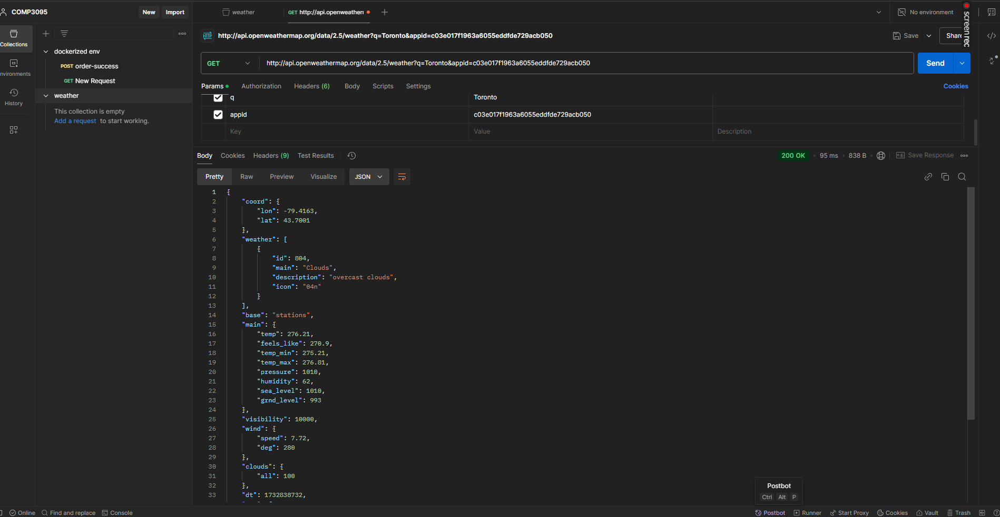

# **Weather Explorer**

Weather Explorer is an intuitive web application that offers real-time weather data and forecasts for any city across the globe. Designed with a modern and minimalistic approach, the app provides a seamless user experience to access weather details in just a few clicks.

---

## **Features**
- **Weather Forecast**:
  - Provides accurate weather forecasts for the next 7 days.
  - Includes information on the expected temperature, weather conditions, and precipitation chances.
- **Air Quality Data**:
  - Displays real-time air quality index (AQI) for the selected city.
  - Includes pollution levels, particulate matter, and other environmental factors.
- **Interactive Map**:
  - View a dynamic weather map with real-time cloud cover, temperature, and precipitation.
- **Multiple City Support**:
  - Switch between different cities to compare weather conditions.

---

## **How It Works**
1. **City Search**: Use the search bar to enter any city’s name to get real-time weather data and forecasts.
2. **Weather Dashboard**:
   - View detailed weather forecasts for the coming days, including temperature, conditions, and precipitation.
   - Air quality index is displayed alongside the weather data.
3. **Compare Cities**: Add multiple cities to the dashboard and view their weather side by side.

---

## **Screenshots**

| **Feature**              | **Screenshot**                                                                 |
|---------------------------|-------------------------------------------------------------------------------|
| **City Weather Overview** |     |
| **Air Quality Data**      |           |
| **Weather Map**           |                                            |

---

## **API Reference**
Weather Explorer utilizes data from the **OpenWeatherMap API** for weather and forecast data, and **AirVisual API** for air quality information. Here’s an example of how to access the data:

**Weather Data Endpoint**:

**Air Quality Endpoint**:

http://api.airvisual.com/v2/city?city=<CITY_NAME>&state=<STATE>&country=<COUNTRY>&key=<API_KEY>

---

## **Technology Stack**
- **Frontend**: ReactJS
- **Styling**: Tailwind CSS
- **Icons**: React Icons
- **Weather API**: OpenWeatherMap
- **Air Quality API**: AirVisual

---
